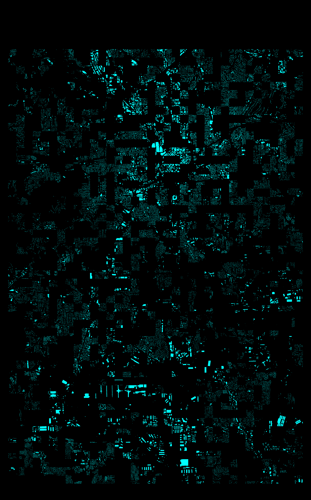
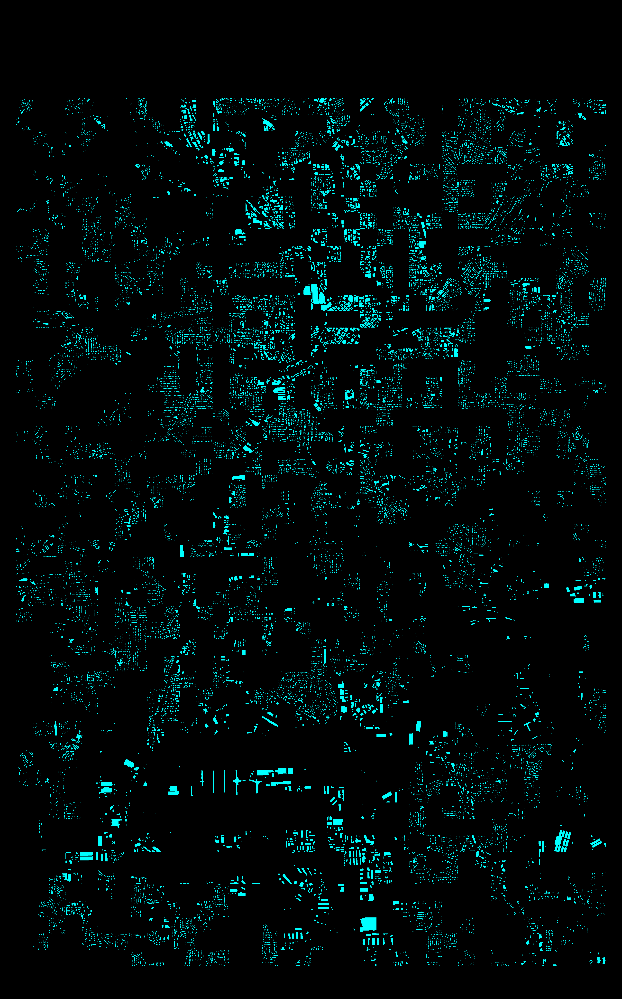
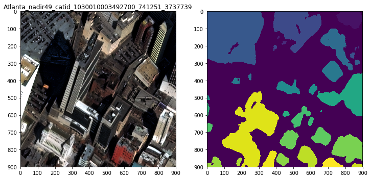
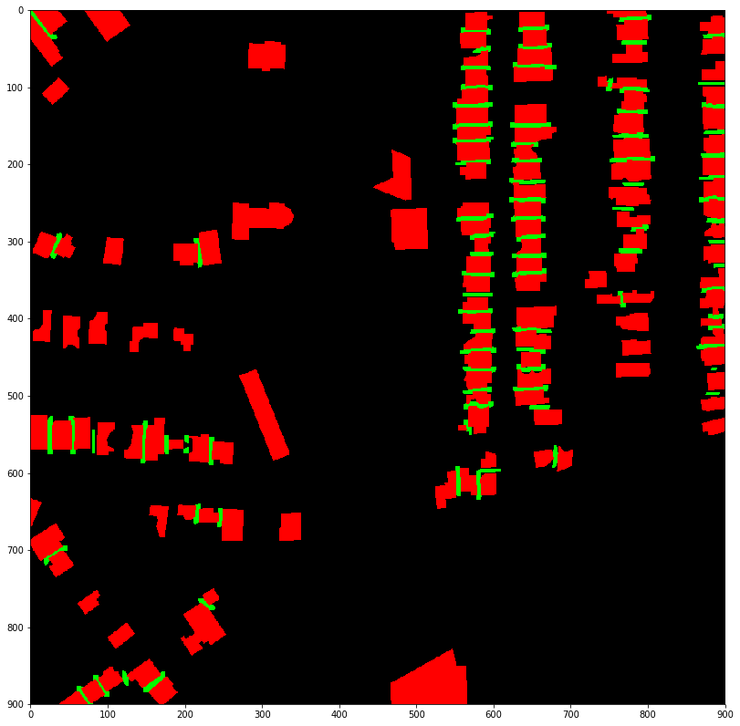

# XD_XD’s report

## My approach

As already described on the DownLinQ blog[1], my approach is U-Net model with VGG16 encoder. The encoder is pretrained on ImageNet. Pretrained models helps to improve the accuracy. I used 5 folds cross-validation for local validation. Due to the time limitation for training, I used first 4 of 5 folds for averaging models.

[1] “The SpaceNet Challenge Off-Nadir Buildings: Introducing the winners” https://medium.com/the-downlinq/the-spacenet-challenge-off-nadir-buildings-introducing-the-winners-b60f2b700266

## Other things I tried: Other encoders

As for the encoder of U-Net, I tried to use DPN and ResNet. Their performance are almost same in my experiment. On the other hand, VGG11 scores significantly worse than VGG16 on the provisional leaderbaord.

## Other information I feel would be useful

### Bug on preprocessing part

The baseline code provided by the organizer has a bug to generate incorrect label masks. I fixed it, but it’s no significant impact for improving the evaluation score. See following images. First mask image (train_mask_v1.png) is generated by the original code. Second one (train_mask_v4.png) is generated by the fixed code.

### Error analysis: Tall buildings

As a result of error analysis, the segmentation result of the tall building was terrible. If the test image contains all off-nadir angles, other interesting approaches might be possible. For example, 3D modeling

### Touching border

I tried to use a touching border mask[2], but it doesn’t significantly improve the evaluation score in my experiment.

[2] "[ods.ai] topcoders, 1st place solution" https://www.kaggle.com/c/data-science-bowl-2018/discussion/54741

### Bad user interface, but clever rules and guidelines

(This is a messages to TopCoder admin.)

I feel that TopCoder's UI (user interface) is bad. There is no direct link to the page that submits a code from the leader board page. There are too few links to the registration page, and it’s hard to find the link for beginners. There are many other complaints about UI... However, the contest rules and guidelines are very well designed. The hardware limitation and requiring a Dockerized solution is a clever rule. As for the fairness and reproducibility, I prefer TopCoder's rule rather than Kaggle Kernel.
