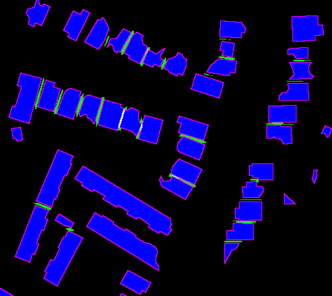

# SpaceNet Building Detector - Solution Description (cannab)

## Overview
Congrats on winning this marathon match. As part of your final submission and in order to receive payment for this marathon match, please complete the following document.

##	Introduction
Tell us a bit about yourself, and why you have decided to participate in the contest.
- Name:
- Handle: cannab
- Placement you achieved in the MM: 1st
- About you: I’m independent Software Developer/Data Scientist interested in hard algorithmic challenges and machine learning
- Why you participated in the MM: I liked previous SpaceNet challenge a lot

## Solution Development
How did you solve the problem? What approaches did you try and what choices did you make, and why? Also, what alternative approaches did you consider?
- 	I’ve participated in similar competitions for one-class instance segmentation (1st place in Data Science Bowl 2018, 2nd place in Airbus Ship Detection Challenge and 3rd place in Urban 3D Challenge). I’ve solved them with the same evolved method using semantic segmentation. So, for this problem I’ve used the same approach with best tricks worked before.
-	The main part is Neural Networks (NN) for segmentation with encoder-decoder architecture similar to UNet  ( https://arxiv.org/pdf/1505.04597.pdf ). Used different pretrained encoder for ensembling (Transfer Learning).
-	Next part is post-processing with watershed algorithm and LightGBM models to predict True Positives and False Positives.
-	Tried heavy image augmentations (usually works for satellite imaging data). But realised that satellite made images from certain positions and rotations and flips just make score worse.
-	Used additional inputs and auxiliary outputs for NN trainings: nadir (output after encoder and input to decoder), catalog id one-hot encoded, x and y coordinates of tile, occluded buildings as auxiliary output (also segmentation).
-	It was critical to separate folds (train/validation) by tiles to avoid leakage.
-	Ensemble of 4 models and 8 folds used to achieve best score in competition. But even one fold of single model without LightGBM gives very good performance (660+ on provisional leaderboard and enough for top5 in final for sure).

##	Final Approach
Please provide a bulleted description of your final approach. What ideas/decisions/features have been found to be the most important for your solution performance:
-	Finally, I’ve used 4 Neural Network architectures for ensemble with same UNet-like decoder and different pretrained encoders:
  -	Pretrained SE-ResNeXt50 encoder, trained on 8 folds.
  -	Pretrained DPN92 encoder, trained on 8 folds.
	- Pretrained SE-Net154 encoder, trained on 8 folds.
  - Pretrained SE-ResNeXt101 encoder, trained on 4 folds.
- Neural Network inputs:
  - Main input is an image with 9 channels: 4 channels from Pan-Sharpen image + 4 other channels from MUL images + 1 PAN channel.  
  - Additional inputs fused with decoder layers: nadir, catalog id one-hot encoded, tile x and y coordinates.
- Outputs:
  - Main targets for segmentation (masks): building bodies, building borders (for better shapes learning and separation), separation area (pixels between neighbor buildings):
  
  - Additional (auxiliary) outputs with low weight in loss function: nadir (after encoder, to help NN better recognize angles itself); Occluded buildings (building bodies only for occluded images, as additional 4th channel to main mask).

- Loss function used for training NN is combination of Dice and Folca losses: (Dice + 10 * Focal)
- Predicted Buildings mask separated to instances using predicted borders and separation lines, then watershed algorithms used to extend seeds to original size:
Seeds = Building_Body * (1 - Separation_Line) * (1 - 0.1 * Building_Border)
- Then for each candidate extracted following features to train LightGBM models:
  -	Area
  -	Is Contour Convex or Not, Convex area
  -	Min Area Rectangle’s features: min side, max side, side’s ratio
  -	Solidity, eccentricity, extent
  -	Perimeter
  -	Major and minor axis length
  -	Mean and std for RGB values, prediction values, nDSM
  -	Neighbor candidates count in distance of 100, 200, 300, 400 meters
  -	Median area of neighbors and it’s ratio to candidate area
-	LightGBM model used to separate True Positives and False Positives, then threshold selected to get best competitions metric score.

## Open Source Resources, Frameworks and Libraries
Please specify the name of the open source resource along with a URL to where it’s housed and it’s license type:
-	Anaconda as base Python 3 environment, www.anaconda.com
-	Pytorch, https://pytorch.org
-	Pretrained models, https://github.com/Cadene/pretrained-models.pytorch
-	OpenCV, https://opencv.org BSD License
-	LightGBM, https://github.com/Microsoft/LightGBM The MIT License
-	Shapely, https://github.com/Toblerity/Shapely

##	Potential Algorithm Improvements
Please specify any potential improvements that can be made to the algorithm:
-	More different NN architectures, new decoders like FPN etc.
-	Mask-RCNN for ensemble

## Algorithm Limitations
Please specify any potential limitations with the algorithm:
Models rely on catalog id and nadir angle, this gave some score improvement. So for new data from another satellite positions need to retrain with subset of new data.

## Deployment Guide
Please provide the exact steps required to build and deploy the code:
	Dockerized version prepared as requested. For clean installation python 3 required with libraries (all in anaconda3 default installation): numpy, sklearn + install OpenCV, Pytorch, LightGBM, Shapely
