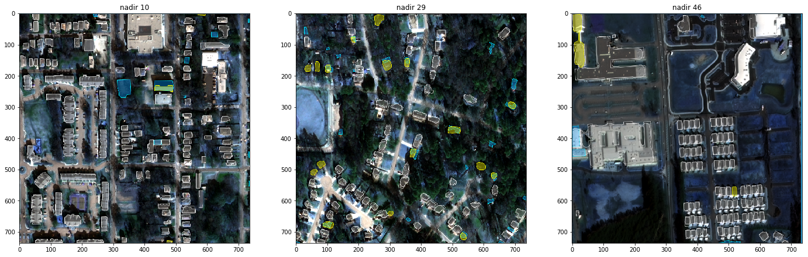

**SpaceNet Off-Nadir Challenge - Solution Description**

**Overview**

1. **1.**** Introduction**

     **●●** Handle:  number13
     **●●** Author: 

1. **2.**** Solution Development**

    I used Mask R-CNN, implemented by Matterport, a two-stage object detection
    architecture to detect the buildings footprints. Although only a single
    class was required to be detected, I felt this approach would be competitive against other
    semantic approaches such as U-Net, specifically given that the evaluation was done at IoU 0.5.

    The specific challenge of this dataset was the footprint detection at off and very nadir angles.
    As the angle increases from 7 degrees, the resolution  decreases and the footprint becomes
    relatively misalighned, making the detection task progressively difficult.
    I also used pre-trained weights from crowdai mapping challenge dataset,
    which also involved building detection.

    
    *Sample prediction vs ground-truth at nadir, off-nadir and very-nadir angles, using given visualization tools*

1. **3.**** Final Approach**

    **●●**  Change of anchor scales from the default of  32, 64, 128, 256, 512 to 8, 16, 32, 64, 128 is key.

    **●●** The change of stride in the first stage of the Resnet-101 backbone from  1
    to 2 is also necessary, since we are dealing with  small objects, as is usual
    in remote sensing imageries.

    **●●** I started with 512x512 uint8, RGB image patches. Model weights trained on these images are transfered to train the final models
    which uses uint16 512x512 patches. I found (InfraRed 1, Red, Green ,Blue) to be best suited for Nadir and Off-Nadir, while a simple
    pan-sharpened images from (InfraRed 2, InfraRed 1, Red) to be better for Very-Nadir. For each angle, a single model was trained
    as I found fine-tuning each angle gave the best result. There are no further ensembles, so the inference exectution time
    on the public testset is **1 hour 45 minutes**.

    **●●** The given image dimension was 900x900, so merging the 512x512 patches for the final result required the
    development of patch-border objects handling routine.

The Training steps are summarized below:

| Step   | Train Procedure   | dtype  | band | Load weights|
| ------ |:-----------------:|:------:|:----:|:-----------:|
| Step 1 | Train on Nadir 7 only for 4 epoch | uint8  | RGB     | crowdAI pretrained    |
| Step 2 | Train on All Dataset for 1 epoch  | uint8  | RGB     | From step 1           |
| Step 3 | Train on OFF-NADIR angle ranges   | uint8  | (7,6 4) urban bands   | From step 2 |
| Step 4 | Train on OFF-NADIR angle range    | uint16 | (7,6 4) urban bands   | From step 3 |
| Step 5 | Train on NADIR angle range        | uint16 | (7,6 4) urban bands   | From step 4 |
| Step 6 | Train on VERY-NADIR angle range   | uint16 | (7,6 4) urban bands   | From step 4 |
| Step 7 | Cascade VERY-NADIR angles    | uint16 | (7,6 4) urban bands   | Start From step 6 |
| Step 8 | Fine tune each VERY-NADIR    | uint16 | (7,6 4) urban bands | |
| Step 9 | Train NADIR angle ranges     | uint16 | IRGB, 4 channel                | From step 4 |
| Step 10| Train OFF-NADIR angle range  | uint16 | IRGB, 4 channel       |  From step 9 |
| Step 11| Cascade NADIR angles         | uint16 | IRGB, 4 channel       |  Start From step 9   |
| Step 12| Fine tune each NADIR angle   | uint16 | IRGB, 4 channel | |
| Step 13| Cascade OFF_NADIR  angles    | uint16 | IRGB, 4 channel       |  Start From step 10  |
| Step 14| Fine tune each OFF_NADIR     | uint16 | IRGB, 4 channel  | |     

1.4.** Open Source Resources, Frameworks and Libraries**

      Docker, https://www.docker.com, (Apache License 2.0)
      Nvidia-docker, https://github.com/NVIDIA/nvidia-docker, ( BSD 3-clause)
      Shapely, https://github.com/Toblerity/Shapely, ( BSD 3-clause)
      Tqdm, https://github.com/noamraph/tqdm, ( The MIT License)
      Tensorflow, https://github.com/tensorflow/tensorflow, (Apache License 2.0)
      Keras, https://keras.io/, ( The MIT License)
      Matterport: https://github.com/matterport/Mask_RCNN, ( The MIT License)
      CrowdAI: https://www.crowdai.org/challenges/mapping-challenge (Creative Commons Attribution-NonCommercial-    ShareAlike 4.0 International])
      Imgaug: https://github.com/aleju/imgaug ( The MIT License)

1.5.** Potential Algorithm Improvements**

    We had nadir, off-nadir and very-nadir images of the same area. So I tried super-resolution using
    generative adversarial network (srgan). This did not work too well for me. The image misalignment
    and a large number of epochs required for super-resolution to work made me avoid this avenue further.
    But Getting super-resolution to work for this dataset, especially for the off and very-nadir images will
    yield a big improvement.

1.6.** Algorithm Limitations**

    Currently, my solution does not handle buildings with holes. I avoided it since there were very few
    buildings with holes in the dataset and my score decreased when I did take it into account.  
    Also, the way I handled patch-border objects means there is a clipping artifact if a building
    is extremely long.

1.7.** Deployment Guide**

    This is a dockerized solution. The Shell train.sh and test.sh scripts are provided to fulfill the
    competition requirements. Better handling of unique cases should be done using the python train and
    inference scripts which takes command line arguments.
